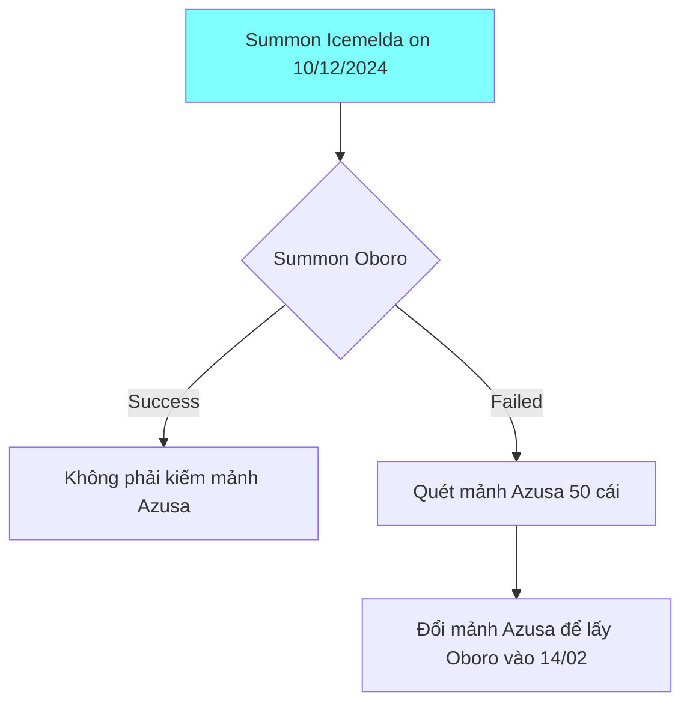

# MyPlans
Dis s my plans

Mong là kế hoạch vẫn ổn, tạch nếu hôm đó không phải là azusa và oboro hic

```mermaid
graph TD;
    classDef active fill:#80ffff


    1[Summon Icemelda on 10/12/2024]:::active --> 2@{ shape: diamond, label: "Summon Oboro" };
    2 --> |Success| 3[Không phải kiếm mảnh Azusa]
    2 --> |Failed| 4[Quét mảnh Azusa 50 cái]

    4 --> 5[Đổi mảnh Azusa để lấy Oboro vào 14/02]
```
